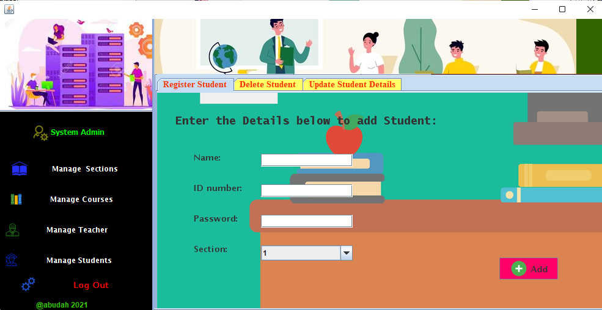
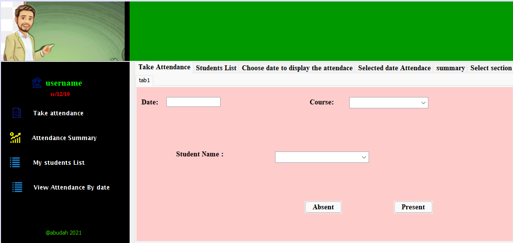
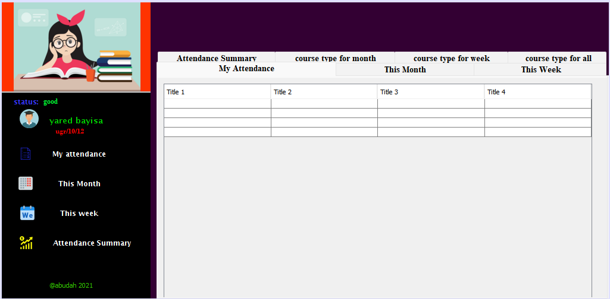

# Jira-Attendancy

Jira-Attendancy is a system that allows teachers to record 
and manage daily student attendance to speed up the daily 
attendance process and reduce paper work.

# Project-Overview

<li>There are 3 roles. student, teacher and super admin. super admin CRUDs the 
section, student, teacher, course and so on. super admin can also assign a 
course and section to a teacher.</li>
<li>A teacher then takes attendance on the system choosing a day, section and 
course.</li>
<li>A student can see his attendance data. the app should support filters like showing 
attendance in certain month/week, for certain course, etc</li>
<li>A system should send attendance statuses like 'warning' etc.</li>

# Screenshots

<h2><li>System Admin Page</li><h2>
  
  
  

  
  
  
<h2><li>Teacher Page</li><h2>
  
  

  
<h2><li>Student Page</li><h2>
  
  

  
  
@abudah 2021
